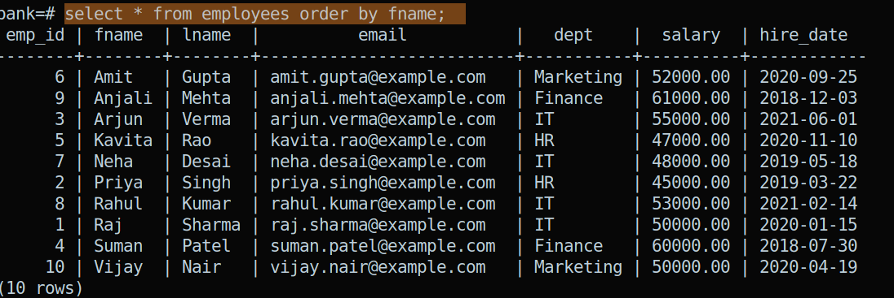

## Clauses

- Where
- Distinct 
- Order By
- Limit
- Like

Clauses -> jab aap sql ki queries execute karte ho to uske saath kuch condition de rahe ho to usko ham clause bolte hai


### Where (clause):
 isse ham specific data ko fetch/target kar sakte hai 

- for getting all cols of employee whose emp_id=5
 ```
 select * from employees where emp_id=5;
 ```
- for getting all employees(their all data) whose dept is "HR"
 ```
 select * from employees where dept='HR';
 ```
 - for getting all employees(their all data) whose salary is greater than 50000
```
select * from employees where salary>=50000;
```
- here we are using relational 'or' operator for getting all employees data whose dept is either 'HR' or 'Finance'
```
select * from employees where dept='HR' or dept='Finance';
```
- here  we are using 'and' operator to meet both condition
```
 select * from employees where dept='HR' and salary>=40000;

```
### Logical Operator
- and
- or


### Relational Operator
```
<  (less than)
>  (greator than)
<= (less than or equal to)
>= (greator than or equal to)
=  (equal to)
!= (not equal to)
```

#### in , not in
- getting all employees which are in departments 'IT','HR','Finance'
```
select * from employees where dept in('IT','HR','Finance');

```

- getting all employees which are not in departments 'IT','HR','Finance'
```
select * from employees where dept not in('IT','HR','Finance');
```

#### between
- used for range 

```
select * from employees where salary between 40000 and 60000;
```

## Distinct 
- unique values 
- get all department but there is repetetion as it will give all row value not unique

```
select dept from employees;
```

- For unique and distinct department

```
select distinct dept from employees;
```

## Note:- 
- Kisi bhi coloumn ke phle agar distinct use kar rahe to wo us coloumn ki unique values dega 

## Order By
- Used in Sorting of data (alphabetically)
- jis coloumn pe order by lagega uske basis pe alphabatically order me consider karke sort kar dega

- here it is sorted using fname
```
select * from employees order by fname;

```


